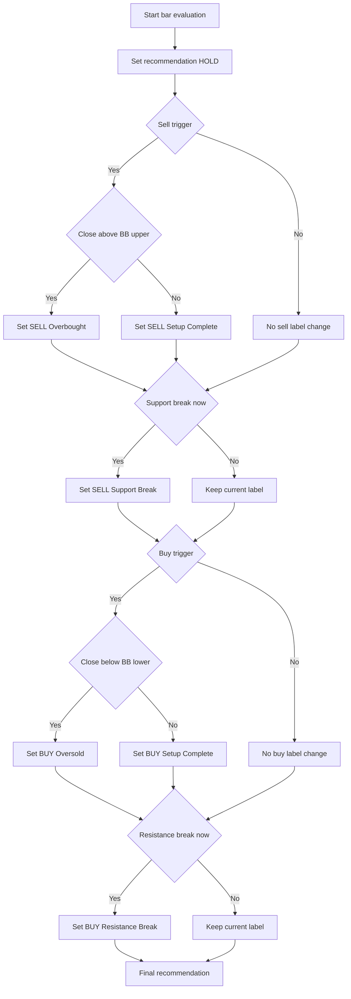

# DeMark Sequential Indicators with yfinance

A robust technical analysis engine that implements Tom DeMark’s Sequential and Countdown indicators using `yfinance` data.

## Features

- **TD Setup**: Identifies 9-count setups using price-flip gating and setup perfection checks.
- **TD Countdown**: Tracks 13-count exhaustion signals following a completed setup.
- **Bar 13 Qualification**: Enforces DeMark-style qualification using Low[13] <= Close[8] for buy countdowns and High[13] >= Close[8] for sell countdowns.
- **Countdown Recycle Tracking**: Flags extended same-direction setup conditions that reset an active countdown after 18 extension bars.
- **TDST Lines**: Calculates support and resistance from setup bar 1, matching TDST conventions.
- **Vectorized Engine**: High-performance calculations using `pandas` and `numpy`.
- **Trading Recommendations**: Multi-factor decision engine integrating:
  - **Exhaustion Signals**: Setup 9 and Countdown 13 completion.
  - **Volatility Filtering**: Overbought/Oversold detection using Bollinger Bands.
  - **Trend Breakouts**: Event-driven alerts for TDST Support/Resistance crossovers.
- **Interactive CLI**: Fetch data for any ticker and visualize the results.
- **Browser-Compliant Plot Artifacts**: Generate Plotly HTML outputs for native browser interactivity.

## Installation

Ensure you have Python 3.11+ and `uv` installed.

```bash
# Install dependencies
uv pip install -r requirements.txt
```

## Usage

Run the analysis for any ticker or scan a list:
```bash
# Single ticker analysis
uv run demark --ticker NVDA --interval 1d --period 1y --plot
uv run demark --ticker NVDA --interval 1d --period 1y --plot --plot-output-mode both
uv run demark --ticker AAPL --interval 1d --period 1y --plot --plot-output-mode html
uv run demark --ticker AAPL --period 1mo --no-save
uv run demark --ticker AAPL --interval 1d --period 1y --debug-setups

# Bulk scan mode (reads from a file, returns only BUY/SELL signals)
uv run demark --scan line.txt
uv run demark --scan watchlist.txt --interval 1h --period 1mo
```

### CLI Arguments

- `--ticker`: The stock ticker symbol (e.g., AAPL, BTC-USD, NVDA).
- `--scan`: Path to a text file with a list of tickers (space-separated or line-separated) to analyze. Returns only those with `BUY` or `SELL` signals.
- `--interval`: Data interval (1m, 2m, 5m, 15m, 30m, 60m, 90m, 1h, 1d, 5d, 1wk, 1mo, 3mo).
- `--period`: Data period (1d, 5d, 1mo, 3mo, 6mo, 1y, 2y, 5y, 10y, ytd, max).
- `--plot`: Optional flag to generate plot artifacts.
- `--plot-output-mode`: Output mode used with `--plot` (`png`, `html`, `both`). Default is `png`.
- `--no-save`: Optional flag to skip writing CSV and plot artifacts to `analysis/`.
- `--debug-setups`: Optional flag to print setup completion diagnostics (useful when TDST support/resistance is `NaN`).

### Plot Output Artifacts

- `png`: Writes a static PNG chart.
- `html`: Writes a browser-compliant Plotly HTML chart (interactive zoom/hover, standalone file).
- `both`: Writes both PNG and HTML artifacts for the same run.

HTML output is generated as a standalone file so it can be opened directly in modern browsers without a Python runtime.

## Project Structure

- `demark/`: Core package.
  - `providers.py`: `yfinance` data fetching and cleaning.
  - `engine.py`: Vectorized DeMark indicator logic.
  - `cli.py`: Command-line interface and plotting.
- `tests/`: Unit and integration tests.
- `openspec/`: Project specifications and task tracking.

## Technical Details

The engine uses a vectorized approach for TD Setup detection, while TD Countdown and TDST calculations use optimized loops for stateful rules such as price-flip starts, perfection checks, countdown recycling, and delayed bar-13 qualification. This keeps the implementation close to DeMark sequencing rules without giving up performance on larger price series.

## Signal Rules (Simple)

This project does **not** treat Setup 9 as an always-sell or always-buy rule.

- **Sell trigger starts** when:
  - Sell Setup = 9, or
  - Sell Countdown = 13
- **Buy trigger starts** when:
  - Buy Setup = 9, or
  - Buy Countdown = 13

After that, the final label depends on extra checks.

### Sell side

1. If sell trigger is true:
   - If price > upper Bollinger Band -> `SELL (Overbought)`
   - Else -> `SELL (Setup Complete)`
2. If price crosses **below** TDST support on this bar -> `SELL (Support Break)`

### Buy side

1. If buy trigger is true:
   - If price < lower Bollinger Band -> `BUY (Oversold)`
   - Else -> `BUY (Setup Complete)`
2. If price crosses **above** TDST resistance on this bar -> `BUY (Resistance Break)`

### Important

- A Setup 9 signal is a **trigger**, not always the final output by itself.
- The final recommendation is based on the full rule flow above.

## Signal Decision Tree (Mermaid)



## License

MIT
